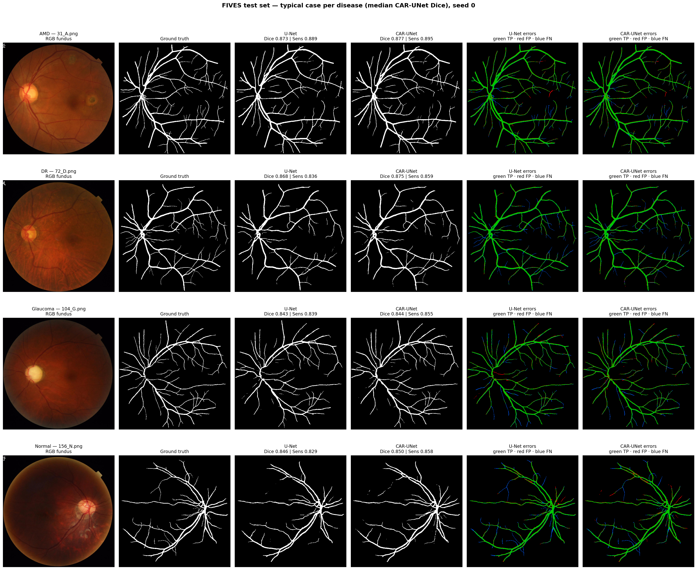

# Retinal Blood Vessel Segmentation using CAR-UNet on the FIVES Benchmark

[](https://www.python.org/)
[](https://pytorch.org/)
[](https://developer.nvidia.com/cuda-toolkit)

An end-to-end deep learning pipeline for automated retinal blood vessel segmentation in fundus photography. The project moves from the classical **Ronneberger U-Net (2015)** on the small **DRIVE** dataset (Review 1) to **Channel Attention Residual U-Net (CAR-UNet)** — [Guo et al., IEEE ICASSP 2021](https://arxiv.org/abs/2004.03702) — on the multi-disease **FIVES** dataset (800 images: AMD, Diabetic Retinopathy, Glaucoma, Normal).

---

## 📊 Results on FIVES (all 200 test images)

Both models were trained by the same script with identical settings (30 epochs, 3 seeds). Metrics are computed per image inside the field of view (threshold 0.5) and averaged over all 200 test images; ± is the standard deviation over seeds.

| Model | Params | Accuracy | Sensitivity | Specificity | **Dice (F1)** | IoU | AUC-ROC |
|---|:---:|:---:|:---:|:---:|:---:|:---:|:---:|
| U-Net | 31.0 M | 0.9723 ± 0.0005 | 0.8247 ± 0.0078 | 0.9852 ± 0.0008 | 0.8344 ± 0.0034 | 0.7246 ± 0.0050 | 0.9847 ± 0.0008 |
| **CAR-UNet** | 32.4 M | **0.9728 ± 0.0007** | **0.8310 ± 0.0126** | **0.9855 ± 0.0018** | **0.8382 ± 0.0031** | **0.7295 ± 0.0043** | **0.9860 ± 0.0014** |

**Dice per disease (50 test images each):**

| | AMD | DR | Glaucoma | Normal |
|---|:---:|:---:|:---:|:---:|
| U-Net | 0.8630 | 0.8550 | 0.7887 | 0.8309 |
| CAR-UNet | **0.8643** | **0.8562** | **0.7958** | **0.8363** |

**What this means:**
- CAR-UNet is better on **154 of 200** test images (paired Wilcoxon p = 2.2×10⁻¹⁴), with the largest gains on Glaucoma and Normal images.
- The average gain is **small (+0.004 Dice)** — about the size of the variation between training runs (CAR-UNet was better in 2 of 3 seeds) — and it costs ~27% more training time.
- The remaining errors are mostly **missed thin capillaries**, and two very low-quality Glaucoma images that both models fail on.

Full tables, significance tests and per-run numbers: [`results/RESULTS_TABLE.md`](results/RESULTS_TABLE.md). Detailed analysis: [`REVIEW2.md`](REVIEW2.md).



> The Review 1 DRIVE result (Dice 0.759 on 4 validation images) is reported separately in [`REVIEW.md`](REVIEW.md); it is not directly comparable because it uses a different dataset.

---

## 🌟 CAR-UNet Architecture

```
Input Patch (284x284)
  │
  ├──> [Encoder Level 1: CADRB (64)] ─── MaxPool ──> [MECA Skip Attention 1]
  │         │                                                    │
  ├──> [Encoder Level 2: CADRB (128)] ── MaxPool ──> [MECA Skip Attention 2]
  │         │                                                    │
  ├──> [Encoder Level 3: CADRB (256)] ── MaxPool ──> [MECA Skip Attention 3]
  │         │                                                    │
  ├──> [Encoder Level 4: CADRB (512)] ── MaxPool ──> [MECA Skip Attention 4]
  │         │                                                    │
  └──> [Bottleneck: CADRB (1024) + Dropout 0.5]                  │
            │                                                    │
       ConvTranspose ────────────────── Concat & Crop <──────────┘
            │
       [Decoder Levels 4 to 1: CADRB]
            │
       1x1 Conv + Sigmoid ──> Output Vessel Mask (100x100)
```

1. **Modified Efficient Channel Attention (MECA):** Channel recalibration without dimensionality reduction, using a 1D convolution with adaptive kernel size:
   $$k = \psi(C) = \left| \frac{\log_2(C) + b}{\gamma} \right|_{\text{odd}}$$
2. **Channel Attention Double Residual Blocks (CADRB):** Residual (identity shortcut) blocks with embedded channel attention.
3. **Bridge Attention on Skip Connections:** Encoder feature maps are recalibrated by MECA before being concatenated with the decoder.
4. **Ronneberger Overlap-Tile Strategy:** Valid convolutions (`padding=0`) with mirror-padded sliding-window inference for seamless full-image predictions.

---

## 🧪 Evaluation Protocol

| | |
|---|---|
| Data | FIVES resized 2048×2048 → 512×512; preprocessing: green channel → CLAHE → bilateral filter → [0, 1] |
| Split | 600 training images → 480 train / 120 validation, **stratified by disease** (30 per disease in validation), fixed seed; 200 test images (50 per disease) |
| Training | 284×284 → 100×100 patches, 6 fresh random patches per image **every epoch**, flips / rotations / elastic deformation; 0.5·BCE + 0.5·Dice; Adam (lr 1e-3), cosine schedule, batch 8, 30 epochs |
| Model selection | Best mean Dice on the 120 full validation images |
| Repeats | Seeds 0, 1, 2 for each model; paired Wilcoxon test on per-image Dice |

An earlier version of these results (Dice 0.7744 vs 0.7916) used only 50 test images (45 of them Glaucoma), a validation set without DR or Glaucoma images, and different training settings for the two models. Those results are kept in [`results/legacy_v1/`](results/legacy_v1/) for reference only; see the README there.

---

## 📁 Repository Structure

```
.
├── Review2_Complete_CAR_UNet_Pipeline.ipynb  # Main all-in-one notebook (results + live inference demo)
├── Review2_CAR_UNet_FIVES.ipynb              # Short demo notebook
├── main_notebook.ipynb                       # Review 1 DRIVE baseline notebook
├── REVIEW.md / REVIEW2.md                    # Review 1 / current technical reports
├── RESULTS_SUMMARY.md                        # Results summary
├── requirements.txt
│
├── src/
│   ├── car_unet.py                           # CAR-UNet (MECA + CADRB)
│   ├── unet_model.py                         # Baseline U-Net
│   ├── preprocessing_fives.py                # Green channel, CLAHE, bilateral filter, FOV mask
│   ├── data_loader_fives.py                  # Stratified split, per-epoch patch sampling, augmentation
│   ├── losses.py                             # 0.5 BCE + 0.5 Dice
│   ├── metrics.py                            # FOV evaluation metrics
│   └── utils.py                              # Overlap-Tile inference
│
├── scripts/
│   ├── train_fives.py                        # Train + evaluate U-Net or CAR-UNet (identical settings)
│   ├── run_baselines.py                      # All models x seeds, resumable, then summarise
│   ├── summarize_results.py                  # Comparison tables + significance tests
│   ├── make_figures.py                       # Comparison figure + training curves
│   └── resize_fives.py                       # FIVES preparation (2048 -> 512)
│
├── results/
│   ├── RESULTS_TABLE.md                      # All tables and tests
│   ├── comparison_table.csv, per_disease_table.csv
│   ├── runs/<model>_seed<N>/                 # summary.json, per-image test metrics, training history
│   └── legacy_v1/                            # Superseded first results
│
└── outputs/
    ├── final_comparison_figure.png           # Typical test case per disease + error maps
    ├── training_curves.png                   # Loss and validation Dice, mean ± std over seeds
    └── predictions/<model>_seed<N>/          # Saved test predictions
```

Model checkpoints (`models/`, `outputs/saved_models/`) and the datasets (`data/`) are not tracked in git because of their size.

---

## 🚀 Usage

```bash
git clone https://github.com/Abhishek-karthik/Retinal-Vessel-Segmentation-CAR-UNet.git
cd Retinal-Vessel-Segmentation-CAR-UNet
pip install -r requirements.txt

# Prepare FIVES (download from Figshare into data/, then resize to 512x512)
python scripts/resize_fives.py

# Train and evaluate one model / seed
python scripts/train_fives.py --model car_unet --seed 0
python scripts/train_fives.py --model unet     --seed 0

# Or the full comparison: 2 models x 3 seeds (~8 h on an RTX 4050 laptop GPU; safe to stop and rerun)
python scripts/run_baselines.py

# Tables and figures
python scripts/summarize_results.py
python scripts/make_figures.py
```

Then open **`Review2_Complete_CAR_UNet_Pipeline.ipynb`** for the results and a live inference demo.

---

## 📚 References
1. **Guo, C., Szemenyei, M., Hu, Y., Wang, W., Zhou, W., Yi, Y.** *"Channel Attention Residual U-Net for Retinal Vessel Segmentation."* IEEE International Conference on Acoustics, Speech and Signal Processing (ICASSP), 2021. [arXiv:2004.03702](https://arxiv.org/abs/2004.03702)
2. **Jin, K. et al.** *"FIVES: A Fundus Image Dataset for Artificial Intelligence based Vessel Segmentation."* Scientific Data, 2022. [DOI: 10.1038/s41597-022-01564-3](https://doi.org/10.1038/s41597-022-01564-3)
3. **Ronneberger, O., Fischer, P., Brox, T.** *"U-Net: Convolutional Networks for Biomedical Image Segmentation."* MICCAI, 2015. [arXiv:1505.04597](https://arxiv.org/abs/1505.04597)
