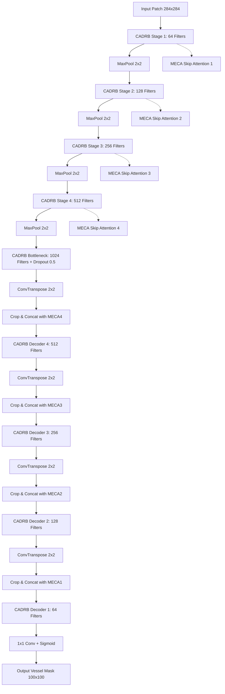

# Automated Retinal Blood Vessel Segmentation Using CAR-UNet on the FIVES Dataset
### Complete Project Review — Medical Image Processing
### Based on: 
1. **Guo et al. (IEEE ICASSP 2021, conference paper / arXiv:2004.03702):** *"Channel Attention Residual U-Net for Retinal Vessel Segmentation"*
2. **Jin et al. (Nature Scientific Data, 2022):** *"FIVES: A Fundus Image Dataset for AI-based Vessel Segmentation"*
3. **Ronneberger et al. (2015):** *"U-Net: Convolutional Networks for Biomedical Image Segmentation"* (Review 1 Baseline)

---

## Executive Summary & Upgrade Context

In **Review 1**, we established a baseline retinal blood vessel segmentation pipeline using the classical **Ronneberger et al. (2015) U-Net** on the **DRIVE dataset** (40 fundus images, $565 \times 584$ resolution). While effective as an initial benchmark (Validation Accuracy: 93.99%, Dice: 75.88%), Review 1 had two key bottlenecks:
1. **Severe Data Scarcity:** DRIVE contains only 20 training images and 20 held-out test images from a single screening program, limiting generalizability across diverse optical conditions and disease stages.
2. **Plain Convolutional Backbone:** Standard U-Net treats all feature channels uniformly and has no residual connections, which can limit how well thin peripheral capillaries are delineated.

In the current version we made a two-fold upgrade, then evaluated it under a fair, repeatable protocol (identical training settings for both models, 3 seeds, all 200 FIVES test images):
1. **Dataset Upgrade (DRIVE $\to$ FIVES):** Replaced DRIVE with the **FIVES benchmark** (800 high-resolution fundus images, standardized to $512 \times 512$). FIVES represents a **$20\times$ increase in scale** and covers four distinct clinical cohorts: Normal, Diabetic Retinopathy (DR), Glaucoma, and Age-related Macular Degeneration (AMD).
2. **Architecture Upgrade (Plain U-Net $\to$ CAR-UNet):** Implemented **Channel Attention Residual U-Net (CAR-UNet)** incorporating:
   - **Modified Efficient Channel Attention (MECA):** Fast, non-dimensionality-reducing channel attention using adaptive 1D convolutions.
   - **Channel Attention Double Residual Blocks (CADRB):** Identity residual mappings embedded with channel attention to facilitate gradient flow and preserve fine vessel margins.
   - **Attentive Skip Connections (Bridge Attention):** Channel-recalibrated skip pathways that filter out irrelevant background artifacts before feature fusion in the expansive path.

**Headline result (mean ± std over 3 seeds, 200 test images):** CAR-UNet Dice **0.8382 ± 0.0031** vs U-Net **0.8344 ± 0.0034** — a small but consistent gain (+0.0038; better on 154/200 images, paired Wilcoxon p = 2.2×10⁻¹⁴), largest on Glaucoma (+0.0071) and Normal (+0.0055) images. The gain is about the size of the seed-to-seed variation (CAR-UNet was better in 2 of 3 seeds), costs ~27% more training time, and leaves thin capillaries and very low-quality images as the main remaining failure modes (Section 10).

---

## Table of Contents

1. [Problem Statement & Clinical Motivation](#1-problem-statement--clinical-motivation)
2. [Dataset Scale Upgrade: DRIVE vs. FIVES](#2-dataset-scale-upgrade-drive-vs-fives)
3. [Classical Preprocessing Pipeline](#3-classical-preprocessing-pipeline)
4. [Patch Extraction & Spatial Augmentation](#4-patch-extraction--spatial-augmentation)
5. [CAR-UNet Architectural Innovations](#5-car-unet-architectural-innovations)
   - 5.1 Modified Efficient Channel Attention (MECA)
   - 5.2 Channel Attention Double Residual Block (CADRB)
   - 5.3 MECA Bridge Attention on Skip Connections
6. [Loss Formulation & Optimization Strategy](#6-loss-formulation--optimization-strategy)
7. [Inference: Ronneberger Overlap-Tile Strategy](#7-inference-ronneberger-overlap-tile-strategy)
8. [Benchmark Results on FIVES](#8-benchmark-results-on-fives)
9. [Visual Comparison & Error Map Analysis](#9-visual-comparison--error-map-analysis)
10. [Analysis, Limitations & Failure Cases](#10-analysis-limitations--failure-cases)
11. [Evaluation Protocol Fixes (v1 → v2)](#11-evaluation-protocol-fixes-v1--v2)
12. [Project Codebase Architecture](#12-project-codebase-architecture)

---

## 1. Problem Statement & Clinical Motivation

Retinal vessel morphology serves as a non-invasive window into the human microvascular and cardiovascular system. Precise delineation of blood vessels enables early diagnosis and monitoring of:
- **Diabetic Retinopathy (DR):** Neovascularization, microaneurysms, and vessel leakage.
- **Glaucoma:** Alteration of cup-to-disc ratio and neuroretinal rim vessel displacement.
- **Hypertension & Stroke Risk:** Arteriolar narrowing and arteriovenous (AV) nicking.
- **Age-Related Macular Degeneration (AMD):** Choroidal neovascularization near the macula.

### Key Technical Challenges
1. **Extreme Class Imbalance:** Vessels occupy only $\approx 8-9\%$ of training-patch pixels on FIVES, with peripheral capillaries often narrower than 2 pixels.
2. **Pathological Distractors:** Exudates, hemorrhages, cotton wool spots, and laser scars exhibit high optical contrast that standard networks frequently mistake for vessels.
3. **Illumination Gradients:** Fundus camera flash creates bright central illumination and dark peripheral vignetting.

---

## 2. Dataset Scale Upgrade: DRIVE vs. FIVES

| Property | Review 1 (DRIVE) | Review 2 (FIVES Upgrade) | Improvement Factor |
|---|---|---|---|
| **Total Images** | 40 images | 800 images | **20× Scale Increase** |
| **Training Split** | 16 train / 4 val | 480 train / 120 val (stratified: 120 / 30 per disease) | **30× Training Scale** |
| **Reported on** | 4 validation images | 200 test images (50 per disease), all evaluated | **50× more evaluation images** |
| **Pathology Coverage** | Diabetic screening only | Normal, DR, Glaucoma, AMD | **Multi-disease Diversity** |
| **Raw Resolution** | $565 \times 584$ | $2048 \times 2048$ (Resized $512 \times 512$) | High-fidelity vascular ground truth |
| **Annotation** | 1 manual rater | Consensus of 3 ophthalmologists + 24 medical staff; manual image-quality grades | Higher annotation reliability |

```
data/FIVES_resized/
├── train/
│   ├── images/      600 RGB fundus images (.png, 512x512) -> 480 train / 120 val, split by disease (seed 42)
│   └── masks/       600 binary ground truth vessel masks (.png)
└── test/
    ├── images/      200 held-out test RGB fundus images (.png, 512x512)
    └── masks/       200 held-out expert ground truth vessel masks (.png)
```

---

## 3. Classical Preprocessing Pipeline

The preprocessing pipeline ported in `src/preprocessing_fives.py` transforms raw RGB images into contrast-boosted grayscale tensors:
1. **Green Channel Extraction:** Hemoglobin has peak optical absorption at $540-575\text{ nm}$, maximizing vessel-to-background contrast.
2. **CLAHE (Contrast Limited Adaptive Histogram Equalization):** `clip_limit=2.0`, `tile_grid_size=(8, 8)` enhances local capillary contrast while preventing noise amplification.
3. **Bilateral Filter Noise Reduction:** `d=5`, `sigmaColor=75`, `sigmaSpace=75` smooths sensor noise while preserving sharp vessel margins.
4. **Min-Max Normalization:** Rescales pixel values from $[0, 255]$ to $[0.0, 1.0]$.

---

## 4. Patch Extraction & Spatial Augmentation

- **Patch Math:** To match Ronneberger valid convolutions (`padding=0`), input patches of size $284 \times 284$ produce centered target masks of size $100 \times 100$ (92-pixel margin on all sides).
- **Patch sampling:** 6 patch centres per training image are drawn at random inside the FOV, and a **new set is drawn every epoch** (2,880 patches/epoch), so the model sees far more of each retina than with a fixed patch set.
- **Data Augmentations:**
  - Horizontal & vertical flips ($p=0.5$)
  - Orthogonal rotations ($0^\circ, 90^\circ, 180^\circ, 270^\circ$, uniform)
  - **Elastic Deformation (Ronneberger et al. 2015):** applied with $p=0.35$; random displacement fields smoothed by $\text{Gaussian}(\sigma=4.0)$ and scaled by $\alpha=25.0$; bilinear interpolation for the image, nearest-neighbour for the mask.

---

## 5. CAR-UNet Architectural Innovations



### 5.1 Modified Efficient Channel Attention (MECA)
Unlike Squeeze-and-Excitation (SE) networks that compress channels through fully connected bottleneck layers ($C \to C/r \to C$), MECA captures local cross-channel interaction directly via a 1D convolution:

$$\mathbf{y} = \text{GAP}(\mathbf{X}) = \frac{1}{H \times W} \sum_{i=1}^H \sum_{j=1}^W \mathbf{X}_{i,j}$$

$$\mathbf{\omega} = \sigma\left(\text{Conv1D}_k(\mathbf{y})\right)$$

$$\mathbf{X}_{\text{out}} = \mathbf{X} \odot \mathbf{\omega}$$

where kernel size $k$ adaptively scales with channel dimension $C$:

$$k = \psi(C) = \left| \frac{\log_2(C)}{\gamma} + \frac{b}{\gamma} \right|_{\text{odd}}$$

### 5.2 Channel Attention Double Residual Block (CADRB)
Each block replaces standard convolution pairs with:

$$\mathbf{F}_1 = \text{ReLU}(\text{BN}(\text{Conv}_{3\times 3}(\mathbf{X})))$$

$$\mathbf{F}_2 = \text{BN}(\text{Conv}_{3\times 3}(\mathbf{F}_1))$$

$$\mathbf{F}_{\text{att}} = \text{MECA}(\mathbf{F}_2)$$

$$\mathbf{Y} = \text{ReLU}\left(\mathbf{F}_{\text{att}} + \text{Crop}(\text{Shortcut}(\mathbf{X}))\right)$$

### 5.3 MECA Bridge Attention on Skip Connections
In vanilla U-Net, encoder feature maps $\mathbf{E}_i$ are directly concatenated with decoder maps $\mathbf{D}_i$. In CAR-UNet, $\mathbf{E}_i$ passes through a dedicated MECA module:

$$\mathbf{E}_{i, \text{att}} = \text{MECA}_i(\mathbf{E}_i)$$

$$\mathbf{Z}_i = [\mathbf{D}_i \,\|\, \text{Crop}(\mathbf{E}_{i, \text{att}})]$$

This suppresses non-retinal background artifacts before feature fusion.

---

## 6. Loss Formulation & Optimization Strategy

We utilize the **Combined Binary Cross-Entropy (BCE) + Dice Loss**:

$$\mathcal{L}_{\text{total}} = 0.5 \cdot \mathcal{L}_{\text{BCE}} + 0.5 \cdot \mathcal{L}_{\text{Dice}}$$

$$\mathcal{L}_{\text{BCE}} = -\frac{1}{N}\sum_{i=1}^N \left[ y_i \log(\hat{y}_i) + (1-y_i) \log(1-\hat{y}_i) \right]$$

$$\mathcal{L}_{\text{Dice}} = 1 - \frac{2 \sum_{i=1}^N y_i \hat{y}_i + \epsilon}{\sum_{i=1}^N y_i + \sum_{i=1}^N \hat{y}_i + \epsilon}$$

Both models are trained by the **same script** (`scripts/train_fives.py`) with **identical settings**:

| Setting | Value |
|---|---|
| Epochs | 30 |
| Batch size | 8 patches |
| Optimizer | Adam ($\beta_1=0.9, \beta_2=0.999$, lr $=10^{-3}$, weight decay $=10^{-5}$) |
| LR schedule | Cosine annealing over 30 epochs |
| Seeds | 0, 1, 2 (Python, NumPy and PyTorch seeded; same train/val split for all) |
| Checkpoint selection | Epoch with the best mean per-image Dice on the 120 **full** validation images (Overlap-Tile inference, inside FOV, threshold 0.5) |
| Hardware | NVIDIA RTX 4050 Laptop GPU (6 GB) |

---

## 7. Inference: Ronneberger Overlap-Tile Strategy

To produce seamless full-image predictions without boundary artifacts:
1. Input image ($512 \times 512$) is mirror-padded by margin ($92\text{ px}$).
2. A sliding window of size $284 \times 284$ moves across the padded image with step size $100\text{ px}$.
3. The network predicts central $100 \times 100$ valid tiles.
4. Output tiles are stitched directly into the full-resolution probability map.
5. Pixels outside the circular Field of View (FOV) mask are suppressed ($=0$).

---

## 8. Benchmark Results on FIVES

All numbers are on **all 200 FIVES test images** (50 per disease), computed per image inside the FOV at threshold 0.5 and averaged; ± is the standard deviation over 3 training seeds. Source: `results/RESULTS_TABLE.md` (generated by `scripts/summarize_results.py`).

| Model | Params | Accuracy | Sensitivity | Specificity | Precision | **Dice (F1)** | IoU | AUC-ROC | AUC-PR |
|---|---|---|---|---|---|---|---|---|---|
| U-Net | 31.0 M | 0.9723 ± 0.0005 | 0.8247 ± 0.0078 | 0.9852 ± 0.0008 | **0.8573 ± 0.0047** | 0.8344 ± 0.0034 | 0.7246 ± 0.0050 | 0.9847 ± 0.0008 | 0.9174 ± 0.0024 |
| **CAR-UNet** | 32.4 M | **0.9728 ± 0.0007** | **0.8310 ± 0.0126** | **0.9855 ± 0.0018** | 0.8557 ± 0.0151 | **0.8382 ± 0.0031** | **0.7295 ± 0.0043** | **0.9860 ± 0.0014** | **0.9202 ± 0.0044** |

### 8.1 Per disease (Dice, 50 test images each, mean over 3 seeds)

| Disease | U-Net | CAR-UNet | Gain |
|---|---|---|---|
| AMD | 0.8630 | 0.8643 | +0.0013 |
| DR | 0.8550 | 0.8562 | +0.0012 |
| Glaucoma | 0.7887 | 0.7958 | +0.0071 |
| Normal | 0.8309 | 0.8363 | +0.0055 |

### 8.2 Is the difference real?

| Test | Result |
|---|---|
| Paired Wilcoxon on per-image Dice (200 images, averaged over seeds) | CAR-UNet better on **154 / 200** images, mean +0.0038, **p = 2.2×10⁻¹⁴** |
| Per seed (same seed for both models) | seed 0: +0.0106 · seed 1: −0.0007 · seed 2: +0.0014 → CAR-UNet better in **2 / 3** seeds |
| Seed-to-seed std of Dice | U-Net 0.0034 · CAR-UNet 0.0031 |

**Reading:** CAR-UNet segments most test images slightly better, but the average gain (+0.004 Dice) is about the same size as the variation between training runs. The improvement is real but small.

### 8.3 Cost

| | U-Net | CAR-UNet |
|---|---|---|
| Parameters | 31.0 M | 32.4 M (+4.5%) |
| Training time (30 epochs, mean of 3 seeds) | 71.4 min | 90.9 min (+27%) |
| Best validation Dice (seeds 0 / 1 / 2) | 0.8631 / 0.8663 / 0.8670 | 0.8681 / 0.8679 / 0.8686 |

*The Review 1 DRIVE result (Dice 0.759) is not compared here: it was measured on 4 DRIVE validation images, a different dataset.*

---

## 9. Visual Comparison & Error Map Analysis

`outputs/final_comparison_figure.png` shows one test image per disease — the image with the **median** CAR-UNet Dice in that group, so these are typical cases, not hand-picked best ones. Columns: RGB | ground truth | U-Net | CAR-UNet | U-Net error map | CAR-UNet error map (green = correct vessel, red = false vessel, blue = missed vessel).

Observations:
1. Both models segment the major vessels and their branches almost perfectly.
2. Nearly all remaining errors are **missed thin capillaries at vessel tips** (blue), plus a few false detections along vessel borders and near the optic disc (red).
3. CAR-UNet recovers slightly more thin vessels (higher sensitivity in all four examples), matching its +0.006 average sensitivity gain.

`outputs/training_curves.png` shows training loss and validation Dice (mean ± std over seeds): both models converge smoothly without overfitting and plateau around validation Dice 0.86 by epoch ~25; CAR-UNet learns faster in the first epochs.

---

## 10. Analysis, Limitations & Failure Cases

1. **The architecture gain is small.** Channel attention + residual blocks add +0.004 Dice / +0.006 sensitivity on average. Most of the change from the earlier (v1) numbers came from fixing the training and evaluation protocol, not from the architecture (Section 11).
2. **Glaucoma is the hardest group** (Dice 0.79 vs 0.83–0.86 for the others) and is also where CAR-UNet helps most.
3. **Thin capillaries remain the main error source** (Section 9) — partly because FIVES images were downsampled from 2048×2048 to 512×512, which erases the finest vessels.
4. **Very low-quality images fail.** Two hazy, very dark Glaucoma images (122_G, 123_G) score Dice < 0.1 for both models; their expert masks contain only 0.7% and 1.7% vessel pixels (typical ≈ 6%) because few vessels are visible at all. They are **kept** in the test set (excluding hard cases would inflate results). Without them the mean Dice would be 0.8422 (U-Net) and 0.8458 (CAR-UNet); median Dice is 0.8614 vs 0.8630.
5. **Implementation differs from the original CAR-UNet paper**: we keep the Ronneberger valid-convolution geometry (284→100 patches) and Dropout rather than the paper's own configuration (e.g. DropBlock), so absolute numbers are not directly comparable with the paper.
6. **Only FIVES** is evaluated; cross-dataset generalisation (e.g. FIVES → DRIVE) has not been tested yet.

These limitations are the starting points for the next upgrade (spatial attention, a connectivity-aware loss such as clDice, higher-resolution training, cross-dataset testing).

---

## 11. Evaluation Protocol Fixes (v1 → v2)

The first FIVES results (kept in `results/legacy_v1/` for reference) had protocol problems that made the comparison unreliable. All were fixed before producing the numbers above:

| Problem in v1 | Fix in v2 |
|---|---|
| Only 50 of 200 test images scored — and, because filenames were sorted as text, these were 45 Glaucoma, 4 AMD, 1 DR, 0 Normal | All 200 test images (50 per disease) |
| Validation set = last 120 filenames = 68 Normal + 52 AMD only (no DR, no Glaucoma) | Disease-stratified split, 30 per disease, fixed seed |
| Separate training scripts with different defaults (5 vs 15 epochs, 2 vs 6 patches/image) | One script, identical settings for both models |
| No seed, one run per model | Seeds 0, 1, 2; mean ± std; paired significance tests |
| Same training patches reused every epoch | Fresh random patches every epoch |
| Model selected on patch-level validation Dice | Selected on full-image validation Dice (same protocol as test) |
| DRIVE row compared with FIVES test results | Removed from the comparison (different dataset) |

v1 reported Dice 0.7744 (U-Net) vs 0.7916 (CAR-UNet); under the fixed protocol the values are 0.8344 vs 0.8382.

---

## 12. Project Codebase Architecture

```
Medical-Image-processing-Project/
├── Review2_Complete_CAR_UNet_Pipeline.ipynb      Main all-in-one notebook (results + live demo)
├── Review2_CAR_UNet_FIVES.ipynb                  Short demo notebook
├── REVIEW.md / REVIEW2.md                        Review 1 / current documentation
├── RESULTS_SUMMARY.md                            Results summary
├── research paper_baseline.pdf                   Ronneberger et al. (2015) U-Net
├── research_paper_upgrade.pdf                    Guo et al. (ICASSP 2021) CAR-UNet
├── data/
│   ├── DRIVE/                                    Review 1 dataset
│   ├── FIVES .../                                Original FIVES (2048x2048)
│   └── FIVES_resized/                            Working copy (512x512)
├── models/                                       Best checkpoints: unet_seed{0,1,2}.pt, car_unet_seed{0,1,2}.pt
├── outputs/
│   ├── final_comparison_figure.png               Typical case per disease + error maps
│   ├── training_curves.png                       Loss / validation Dice, mean ± std over seeds
│   └── predictions/<model>_seed<N>/              One saved prediction per disease per run
├── results/
│   ├── RESULTS_TABLE.md                          All tables + significance tests
│   ├── comparison_table.csv, per_disease_table.csv
│   ├── runs/<model>_seed<N>/                     summary.json, per-image test metrics, training history
│   ├── logs/baselines.log                        Full training log
│   └── legacy_v1/                                Superseded first results (see README there)
├── scripts/
│   ├── train_fives.py                            Train + evaluate U-Net or CAR-UNet (identical settings)
│   ├── run_baselines.py                          Runs all models x seeds (resumable) and summarises
│   ├── summarize_results.py                      Builds tables + significance tests
│   ├── make_figures.py                           Builds comparison figure + training curves
│   └── resize_fives.py                           FIVES preparation (2048 -> 512)
└── src/
    ├── car_unet.py                               CAR-UNet (MECA + CADRB)
    ├── unet_model.py                             Baseline U-Net
    ├── data_loader_fives.py                      Stratified split + per-epoch patch sampling
    ├── preprocessing_fives.py                    Green channel, CLAHE, bilateral filter, FOV mask
    ├── losses.py                                 0.5 BCE + 0.5 Dice
    ├── metrics.py                                FOV metrics
    └── utils.py                                  Overlap-Tile inference
```
